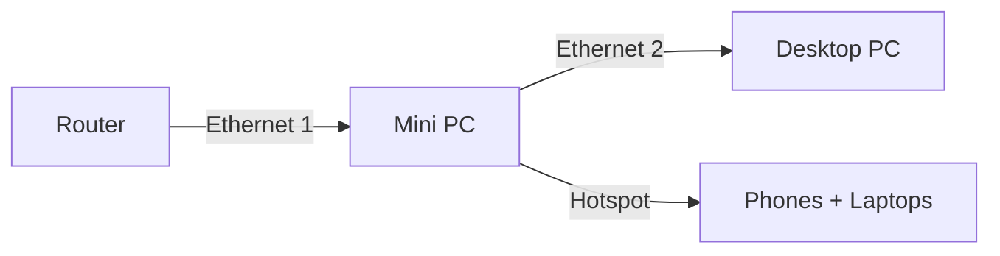

# Proxmox Switch

I have a Mini PC with 2 ethernet ports and a wifi card, In this guide, we'll show how to provide internet to the second ethernet port and create a wifi access point.




## Bridging Ethernet ports

1. Open Web Browser
2. Type Mini PC web Address http://192.168.x.x:8006
3. Select the node (pve)
4. Select Networks. You should see two ethernet devices, enp1s0 and enp3s0 in this case, and 1 wireless device, wlp2s0
5. Select The automatically created Linux Bridge, then Edit
6. In Bridge ports: `enp1s0 enp3s0 wlp2s0`
7. Or you can select Shell and edit the interfaces file: `nano /etc/network/interfaces`

```
auto lo
iface lo inet loopback

iface enp1s0 inet manual

iface enp3s0 inet manual

auto vmbr0
iface vmbr0 inet static
        address 192.168.1.110/24
        gateway 192.168.1.1
        bridge-ports enp1s0 enp3s0 wlp2s0
        bridge-stp off
        bridge-fd 0

auto wlp2s0
iface wlp2s0 inet manual
```

8. Press **Apply Configuration** or type `Systemctl restart networking` in the Shell.

This should provide internet to the computer connected through the second ethernet port.

## Creating the hotspot

You can use the internal wifi card or a USB card. Make sure it's already bridged too.

1. Select the node, then go to the Shell
2. `lspci` and `lsusb` to see list of connected devices, one of them should be a wireless card.
3. `apt install iw`
4. `iw list`, under **Supported interface modes:** the card should show **AP**. Otherwise you won't be able to create a hotspot
5. `apt install hostapd`
6. `nano /etc/hostapd/hostapd.conf`

```
interface=wlp2s0
channel=6
driver=nl80211
hw_mode=g
ssid=choose_a_hotspot_name
wpa=2
wpa_passphrase=choose_a_hotspot_password
wpa_key_mgmt=WPA-PSK
rsn_pairwise=CCMP
auth_algs=1
country_code=US
ap_isolate=0
wpa_group_rekey=0
```
8. `nano /usr/lib/systemd/system/hostapd.service` To make the hostapd service start after the network device in the caste of a reboot

Remove:

```
After=network.target
```

Add instead:

```
BindsTo=sys-subsystem-net-devices-wlp2s0.device
After=sys-subsystem-net-devices-wlp2s0.device
```

9. To start the hostapd service: `systemctl unmask hostapd.service`
10. `systemctl enable --now hostapd`
11. `systemctl restart networking`
