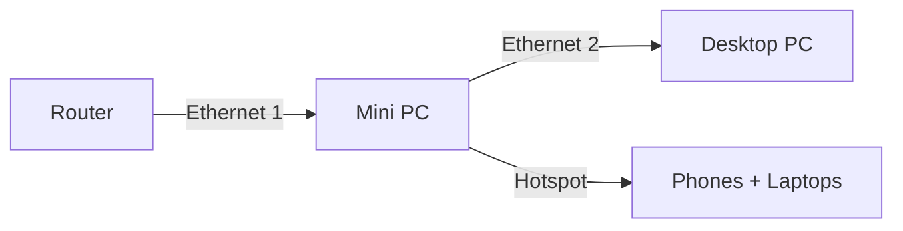

# Proxmox Switch

I have a Mini PC with 2 ethernet ports and a wifi card, In this guide, we'll show how to provide internet to the second ethernet port and create a wifi access point.

```mermaid
graph LR
a[Router] --Ethernet 1--> b[Mini PC] --Ethernet 2--> c[Desktop PC]
b --Hotspot--> e[Phones + Laptops]
```
